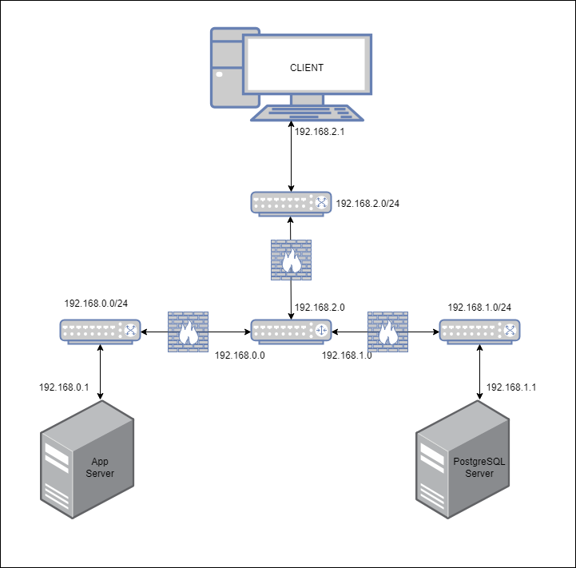
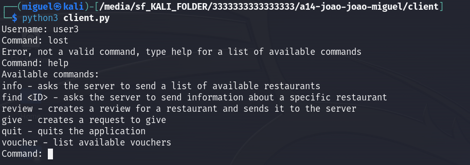

# A14 BombAppetit Project Read Me

## Team

| Number | Name              | User                             | E-mail                              |
| -------|-------------------|----------------------------------| ------------------------------------|
| 92525  | Miguel Nunes      | <https://github.com/MiguelNunes1043>   | <mailto:miguel.c.nunes@tecnico.ulisboa.pt>   |
| 99250  | Joao Vieira       | <https://github.com/JoaoVieira37>     | <mailto:joao.miguel.m.vieira@tecnico.ulisboa.pt>     |
| 93460  | Joao Lima         | <https://github.com/jpvlima> | <mailto:joaolima123@tecnico.ulisboa.pt> |

    


## Contents

This repository contains documentation and source code for the *Network and Computer Security (SIRS)* project.

The [REPORT](REPORT.md) document provides a detailed overview of the key technical decisions and various components of the implemented project.
It offers insights into the rationale behind these choices, the project's architecture, and the impact of these decisions on the overall functionality and performance of the system.

This document presents installation and demonstration instructions.

## Installation
First install the following software on a machine:

To see the project in action, it is necessary to setup a virtual environment, with 3 networks and 4 machines.  

The following diagram shows the networks and machines:



### Prerequisites

All the virtual machines are based on: Linux 64-bit, Kali 2023.3  

[Download](https://cdimage.kali.org/kali-2023.4/kali-linux-2023.4-installer-amd64.iso) and [install](https://www.kali.org/docs/installation/) a virtual machine of Kali Linux 2023.3. 

Install the following software: 
```sh
sudo apt install net-tools
```

```sh
sudo apt-get install postgresql
``` 

```sh
sudo openjdk-17-jdk
```

```sh
sudo apt install mvn
```

```sh
sudo apt-get install python3
```
```sh	
sudo apt install dos2unix
```


For simplicity, let's download the project code to the base machine.

Download the release tag.
 


### Machine configurations

Next we have custom instructions for each machine.

#### Machine 1

This machine runs a database server (PostgreSQL 16.1).
Clone the base machine and set it up with one internal adapter named "sw2".
Move/copy the project folder to a directory where you have permission, like tmp, and run the innitialization script.

```sh
chmod +x db-vm.sh
chmod a+r db-init.sql
dos2unix db-vm.sh #make sure the file is in unix format
sudo ./db-vm.sh
```

The `ifconfig` command should display something like this:


The `ip r` command should display something like this:


If all goes well the database named app is now running and listening on port 5432 and a new user called app with password app was created.

#### Machine 2
This machine runs the backend server (Java Springboot 3.2.0).
Clone the base machine and set it up with one internal adapter named "sw1".
Move/copy the project folder to a directory where you have permission, like tmp, and run the innitialization script.

```sh
chmod +x app-vm.sh
dos2unix app-vm.sh #make sure the file is in unix format
sudo ./app-vm.sh
```
The `ifconfig` command should display something like this:


The `ip r` command should display something like this:


go to the application folder and run:

```sh
mvn install exec:java
```
our server should now be running!

#### Machine 3
This machine runs the client (Python3).
Clone the base machine and set it up with one internal adapter named "sw3".
Move/copy the project folder to a directory where you have permission, like tmp, and run the innitialization script.

```sh
chmod +x client-vm.sh
chmod +x definehostname.sh
dos2unix client-vm.sh #make sure the file is in unix format
dos2unix definehostname.sh #make sure the file is in unix formats
sudo ./client-vm.sh
sudo ./definehostname.sh
```

The `ifconfig` command should display something like this:


The `ip r` command should display something like this:


```
mvn clean install
export PATH=$PATH:/tmp/a14-joao-joao-miguel/client/target/appassembler/bin  
```
The path should pe changed to the specific machine, the important part is /a14-joao-joao-miguel/client/target/appassembler/bin, the rest is machine dependent

Run the client with the following command:
```
python3 client.py
```
our client should now be running!

#### Machine 4
This machine serves as the firewall and routing for the networks.
Clone the base machine and set it up with three internal adapter named "sw1,"sw2,"sw3".
Move/copy the project folder to a directory where you have permission, like tmp, and run the innitialization script.

```sh
chmod +x router-vm.sh
dos2unix router-vm.sh #make sure the file is in unix format
sudo ./router.sh
```

The `ifconfig` command should display something like this:


The `ip r` command should display something like this:


The `iptables -L` command should display something like this:


## Demonstration

Now that all the networks and machines are up and running, we can start our client:

```sh
$ python3 client.sh
```


we now have to log in, but we have some predifined users and only those are allowed:

Lets log in with an allowed user:
```sh
$ user3
```

we can now type anything, but we only execute anything if it's an available command:

Let's type help:
```sh
$ help
```

We can see a list of the available commands and their usage, let's type info to get the available restaurants:
```sh
$ info
```

To get a specific restaurant, we can use the command find:
```sh
$ find 1
```


we can see our encoded client-server communication here, the voucher is encrypted and there is also a timestamp and encrypted hash which offers non-repudiation, authenticity and confidentiality

we can see we have a voucher available, let's give it to another user:
```sh
$ give
```
```sh
$ 1
```
```sh
$ user1
```
```sh
$ find
```

We can see the json sent by the client to the server for the request, it is digitally signed with a timestamp and an encrypted hash

We can see we no longer have that voucher, if we log in as user1 we can see it later. Let's write a review for this restaurant
```sh
$ review
```
```sh
$ 1
```
```sh
$ 5
```
```sh
$ Excellent taste, would reccomend!
```
```sh
$ find
```

We can see the json sent by the client to the server for the request, it is digitally signed with a timestamp and an encrypted hash

We can now see our review!

Now let's logout of this user and enter user 2 to view his vouchers:
```sh
$ quit
```
```sh
$ python3 client.py
```
```sh
$ user2
```
```sh
$ vouchers
```

as we can see we recieve a list of vouchers available to the user, this json is sent from the server to the client with the field "code" being encrypted and also with a digital signature including a timestamp, as shown in the following image:


The wireshark captures shown here are for simplicity's sake in illustrating how our documents and security challenge solution work, in reality these are protected with TLS as shown in the following image:


This concludes the demonstration.

## Additional Information

### Links to Used Tools and Libraries

- [Java 17.0.8](https://openjdk.java.net/)
- [Maven 3.9.5](https://maven.apache.org/)
- [Net-tools](https://sourceforge.net/projects/net-tools/)
- [PostgreSQL 16.1](https://www.postgresql.org/)
- [Python 3](https://www.python.org/)
- [Springboot 3.2.0](https://spring.io/projects/spring-boot)


### License

This project is licensed under the MIT License - see the [LICENSE.txt](LICENSE.txt) for details.

----
END OF README
