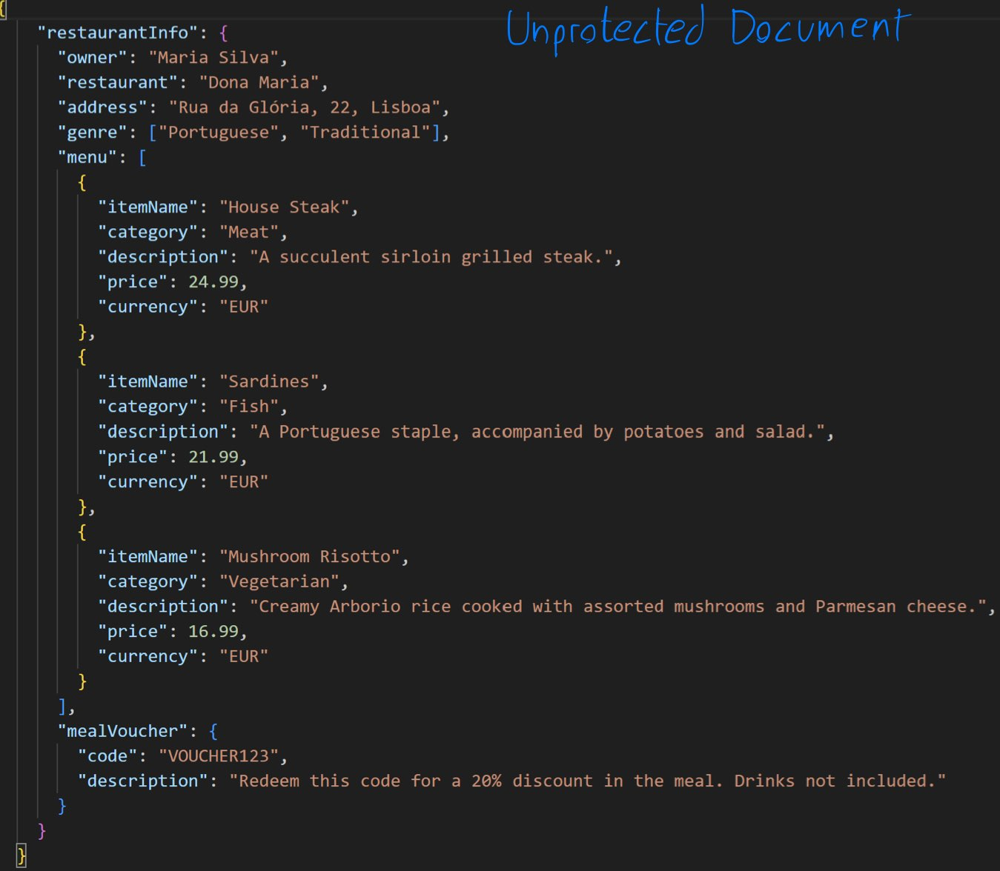
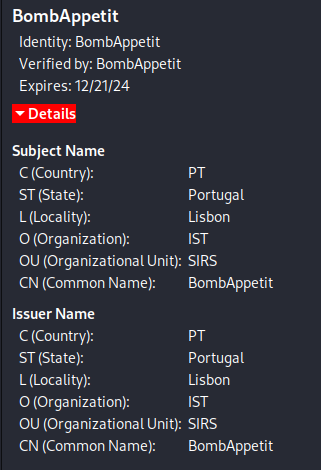
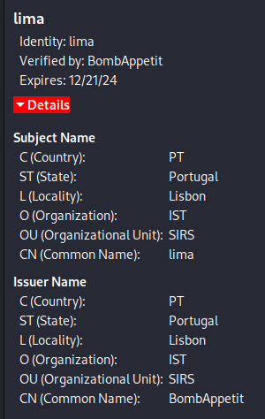

# A14 BombAppetit Project Report

## 1. Introduction
Our project is a CLI implementation of the BombAppetit scenario, it is composed of a java library to encrypt and decrypt json documents, a java springboot backend server, a POSTGRESQL database and a client python script that run commands on the command line.

The BombApetit secure documents is that we were required to create a way in which to protect, unprotect and check documents containing restaurant info. We did this by using Java's libraries related to cryptography and google's GSON, as well as maven for the command line interface and project dependencies

## 2. Project Development

### 2.1. Secure Document Format

#### 2.1.1. Design

Our custom cryptographic library is composed of:
- Protect - Meant to be used "server side", it encrypts the fields of "mealVoucher" using a client's public key (to be able to later be decrypted by him when sent), subsequently we create a cryptographic hash of the "restaurantInfo" field and add it to a field we create called security. we then generate a nonce randomly and also add it to the security field, which we then encrypt using the server's private key (so the client can decrypt it and check authenticity and freshness using the server's public key which the client is assumed to know).

- Unprotect - Meant to be used "client side", it takes a secure document that has been "Protected" before and strips off the security measures in place, essentially changing it back to before it was protected. This is done by using the client's private key to unencrypt the voucher fields and also by simply removing the security field.

- Check: Meant to be used "client side", checks the authenticity and freshness of a document by checking the encrypted hash against the restaurantInfo field's recalculated hash, and also by checking the list of nonces to see if the encrypted nonce is in it. The encrypted fields are decrypted using the server's public key which the client knows to preform the before mentioned operations.

- Help - Displays available commands and their usage to stdout

#### 2.1.2. Implementation

Since our course's tutorials on the subject were in Java we decided to use that language to implement the secure documents, since we already knew how to use it. We used Java's Crypto and Security libraries for all the cryptographic functions we implemented. The implementation of the secure document functions was relatively straightforward, we used a shared file between check, unprotect and protect to host common functions that other functions would want to use. 
We started implementing protect first, to make sure we could then test it with unprotect and check later. one challenge of protect was not expecting that RSA encryption does not let you encrypt messages any bigger than your key size (minus padding and header), so instead of encoding our voucher to base64 before we encrypted them we simply encoded the already encrypted message, which seemes to fix our problem. 
After protect we implemented check, which recieves a protected document as input and outputs if it's secure or not. The challenge here was actually not during inplementation but during conceptualization, how were we going to create a digital signature to guarantee freshness? We ended up settling on creating a nonce during protect and adding it to a text file then during protect check the recieved nonce against that file. While not a perfect implementation (especially because for a server and client architecture it doesn't work great so we had to change it down the line) it did the job.
Finally came Unprotect which was the easiest one to implement, since our auxiliary functions already created made implementation fairly easy.

To view our original secure document implementation (without the changes we made in order to fit our network later) you have to view the following [commit](https://github.com/tecnico-sec/a14-joao-joao-miguel/commit/e430a317b847b9d9e3013fe957a1ed88f1ce97d4).

### 2.2. Infrastructure

#### 2.2.1. Network and Machine Setup

Our infrastructure is composed of 4 machines, 1 functioning as router, 1 functioning as a PostgreSQL Database server, another functioning as a Java Springboot server and finally a client machine that runs a python script to interact with the server. We also have 3 subnets, one for the client, another for the Database and another for the server. The router machine has a firewall preventing the client subnet from acessing the database subnet, and allowing acess to the server subnet.

We chose to use a router to separate the subnets and to act as a firewall between them, since it is a simple and effective solution to the problem of clients have access to the database server. We chose to use a PostgreSQL database because it is a free and open source database that is very popular and has a lot of support. We chose to use a Java Springboot server because it is a very popular and well supported framework for creating web servers. We chose to use a python client to interact with the server because it is a simple and easy way to interact with the server, while also being a language we are familiar with.

#### 2.2.2. Server Communication Security

Our server communication security is composed by the encryption of sensible data from the client and the server, as well as a connection between the client and the server that is protected by TLS. The server certificate was generated with the a private key different from the one used to encrypt the data, and the client certificate was generated with a private key different from the one used to encrypt the data. The server certificate was self-signed and the client certificate was signed by the server certificate. Below you can see the server certificate and the client certificate:

The server:

The client:

To generate the certificates we created a new key and used openSSL, as ilustrated in the course lab, the materials used to create the certificates are available in the [certificates](certificates) folder.

Both the client and server have each others certificate and public key, so they can verify the authenticity of the other.

The keys available are:
-The server's private key
-The server's public key
-The client1 private key
-The client1 public key
-The client2 private key
-The client2 public key
-The client3 private key
-The client3 public key

But we assume that the server and the client share their respective public keys, so the server has access to the client's public keys and the client has access to the server's public key. The client does not contain the server's private key and the server does not contain the client's private key.

### 2.3. Security Challenge

#### 2.3.1. Challenge Overview

Our security challenge consisted of 2 parts:
 - Introducing reviews to the project, where users can write reviews about a restaurant and read other user's reviews
 - Introducing the ability to be able to give a voucher to another user.

These requirements impacted our original design by making us have to add new functionality to the client (creating a review + sending it to server, requesting a voucher transfer to the server) and to the database (adding support to store reviews) and to the application server (interacting with client's requests and fulfilling them)

#### 2.3.2. Attacker Model

In our implementation we assume that the database server is fully trusted, since it is a machine that is not directly acessible by the client and is only acessible by the application server, which is also fully trusted. We also assume that the application server is fully trusted, since it is a machine that is not directly acessible by the client and is only acessible by the database server, which is also fully trusted. We assume that the client is untrusted, since it is a machine that is directly acessible by the user and is not directly acessible by the application server or the database server. We also assume that the user is untrusted, since he is the one using the client and is the one that is directly acessible by the client.

As the communication between the client and the server is secure, we assume that the attacker cannot read the packets being transmitted between the client and server. Even if he wanted to preform a MiTM attack he would have to have the client's certificate to be able to read the message (without encrypted sensitive data). In addition to this if he wanted to alter any of the unencrypted data he would not be able to because of the encrypted hash. If this attacker happened to store some, for example, reviews, to at a later date spam the server with the same review (replay attack), he would not be able to because of the timestamp in every Json file, which only gives it 2 minutes validity. In summary for an attacker to read the packets he would need the client's certificate, if he wants to alter them in any way he'd need the client's private key. To be an effective threat we know the attacker would need both these artifacts.

#### 2.3.3. Solution Design and Implementation

For the reviews, the client can use the CLI to create and send a review. The JSON containing the review also contains a timestamp, which is digitally signed by creating a hash of the review + timestamp and encrypting it with the private key of the client, this guarantees that the review is authentic and non-repudiable. This JSON is then sent to the server where the digital signature is verified by decrypting and checking the hash against the recieved review + timestamp and by checking if the timestamp recieved is within 2 minutes of the current time (to account for clock skew or clock drift, as well as to prevent against replay attacks). The server then sends the review to the Database to store. Whenever a client asks for a restaurant's info that restaurant's reviews which are stored in the database are sent to him by the server, which digitally signs the message and guarantees authenticity and non-repudiation. We felt there was no need to implement a dynamic client key exchange since we assume the database is secure, the clients have no need to interact with each other since both the client who creates the review and the server who sends the reviews offer security guarantees.

Example json the client sends the server:

For the voucher exchange, the client uses the CLI to request a change for a voucher he has to be transferred to someone else. the JSON containing this request also contains a timestamp which is digitally signed by creating a hash of the request + timestamp and encrypting it with the private key of the client, this guarantees the message validity and authenticity. The client then sends the request and JSON to the application server, where it checks the digital signature and timestamp (like in the reviews) and, if valid and if user does indeed have that voucher, preforms the necessary logic to change the voucher's owner

Example json the client sends the server:

For both these challenges key distribution was not a factor, since the project specification tells us we can assume the user and service share their respective public keys. Since we don't use key distribution between users due to our solution not needing to do so, nothing changes in that regard.

 

## 3. Conclusion

We are able to send and receive reviews, as well as send vouchers to other users. We are also able to protect and unprotect documents, as well as check their authenticity and freshness.

The communication channel between the client and the server uses TLS to keep outside agents from being able to view the data, and even if they could they could not access any sensitive data such as vouchers or alter any message in an undetected way.

If we had more time we ould have liked to implement a frontend for the client to make the User Experience more enjoyable. Also we would add Restaurants, so they can add their own menus and vouchers to the database, and also so they can see the reviews that users have left for them.

This project made us realize that security is a very important part of any project, and that it is very easy to forget about it when you are focused on other aspects of the project. It also made us realize that security is a very complex subject and that it is very hard to implement it correctly, and that it is very easy to make mistakes that can compromise the security of your project.

## 4. Bibliography

We used the following resources to help us with our project:

- [Java Cryptography Architecture](https://docs.oracle.com/javase/8/docs/technotes/guides/security/crypto/CryptoSpec.html)
-[Springboot](https://spring.io/projects/spring-boot)
-[PostgreSQL](https://www.postgresql.org/docs)
-[Python](https://docs.python.org/3/)
-[Maven](https://maven.apache.org/guides/index.html)
-[SIRS TLS Lab](https://github.com/tecnico-sec/Secure-Sockets-in-action#readme)

----
END OF REPORT
